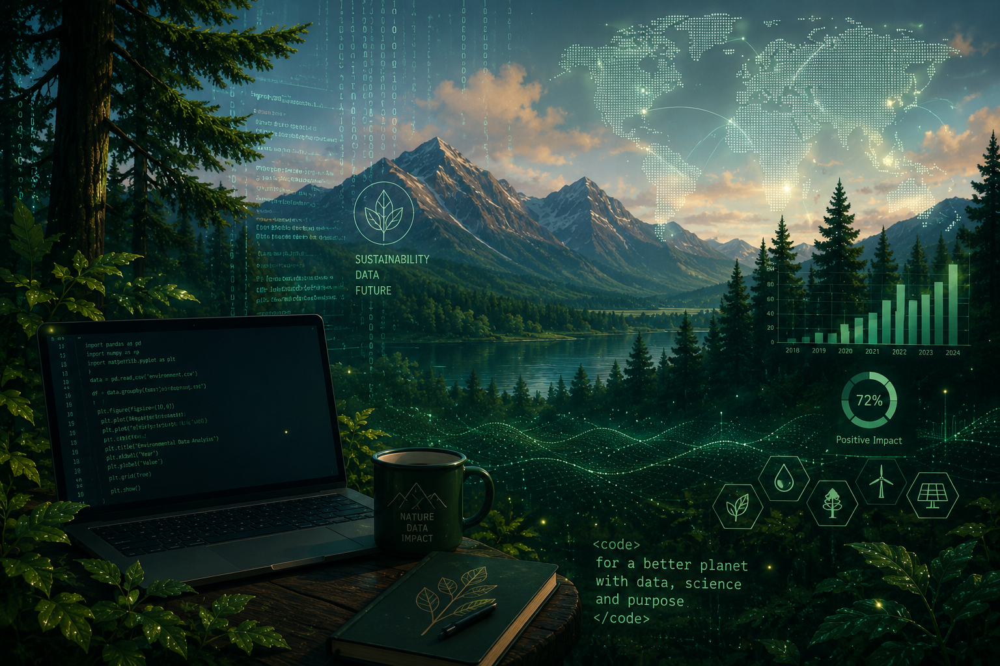

  

<h1 align="center">Hi, I'm Makarena Ampuero 👋</h1>

Environmental professional expanding into data, technology, and applied science.

---

## 🌱 About me

<table>
<tr>
<td width="60%">

Over 1 year of hands-on experience in environmental management, regulatory compliance, and sustainability in the energy sector.

### Currently building skills in:
- Python
- Data Analysis
- Machine Learning
- Data Visualization
- Git & GitHub

</td>

<td width="40%">

📍 Santiago, Chile 

Preparing for my next professional chapter in the UK

</td>
</tr>
</table>

---

## 🚀 Current Projects | 🛠 Tech Stack | 🎯 2026 Goals

<table>
<tr>

<td width="33%">

### Current projects
- Data analysis projects using Python  
- Interactive dashboards  
- Machine learning exercises  
- Academic portfolio  

</td>

<td width="33%">

### Tech stack

`Python`  
`Plotly`  
`Dash`    

</td>

<td width="33%">

### 2026 Goals

✔ Complete my data certification  
✔ Build a strong technical portfolio  
✔ Merge sustainability + data + science  

</td>

</tr>
</table>

---

## 📫 Connect with me

💼 LinkedIn: linkedin.com/in/makarena-ampuero  
📧 Email: makarena.ampuero@mayor.cl  

---

<i>"Using science, sustainability, and technology to create real-world impact."</i>

